# Getting Started with Serverpod + Flutter (Part 1)

*A beginner-friendly walkthrough of creating your first Serverpod project, understanding the project structure, and building your first endpoint.*

This is Part 1 of a series where we'll also be contributing beginner-friendly updates to the [official Serverpod docs](https://docs.serverpod.dev/) as we go.

---

## Prerequisites

Before you start, make sure you have:

- [Flutter](https://flutter.dev) installed
- [Docker Desktop](https://www.docker.com/products/docker-desktop/) installed (Windows, Mac, or Linux)
- The Serverpod CLI installed (`dart pub global activate serverpod_cli`)

---

## Step 1: Create your project

Navigate to the directory where you want your project to live, then run:

```bash
serverpod create your_project_name
```

Serverpod will scaffold everything for you — creating directories, writing project files, fetching dependencies, and generating the Flutter app's platform files. This can take a minute or two.

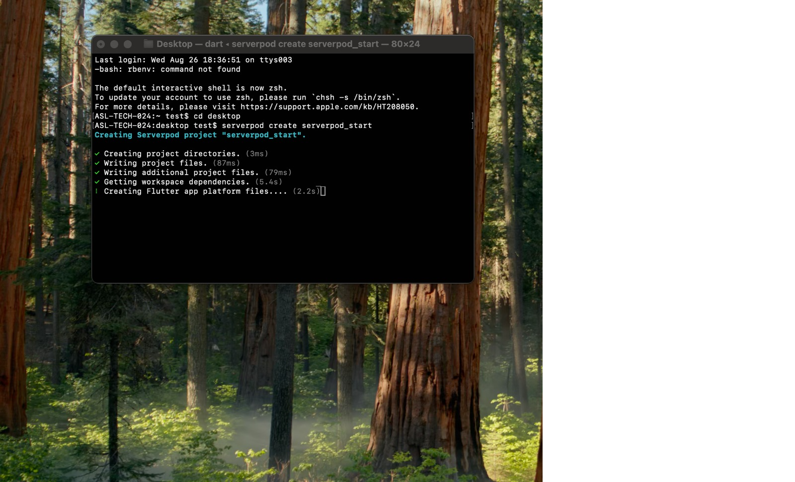

Once it finishes the initial setup, it keeps going — generating code, creating the default database migration, and building the Flutter web app:

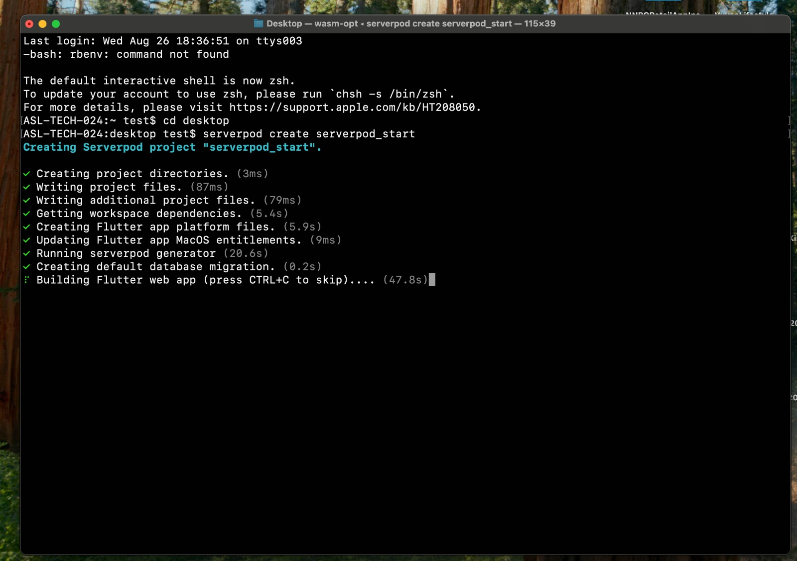

---

## Step 2: Start Docker

While the project is being created (or right after), open **Docker Desktop** — on Windows, Mac, or Linux, it doesn't matter which. You don't need to do anything inside it yet; just leave it running and minimize it. Serverpod uses Docker to run your local Postgres database and Redis cache.

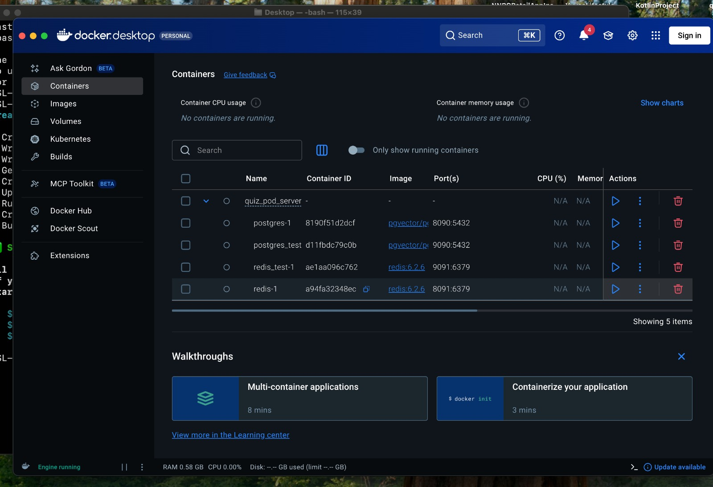

---

## Step 3: Understand the project structure

Once creation finishes, `cd` into your new project folder and take a look around:

```bash
cd your_project_name
ls
```

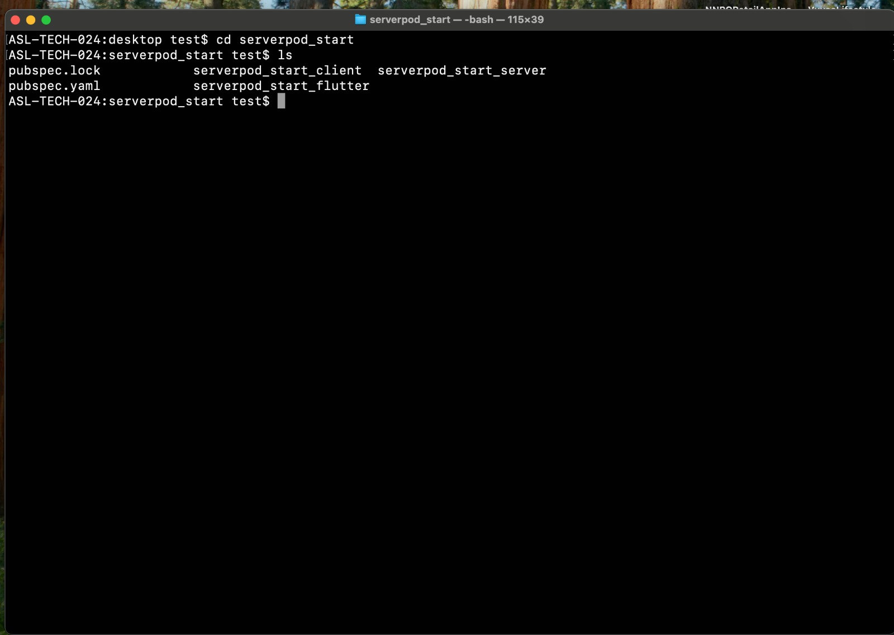

You'll see three sub-projects:

| Folder | What it's for |
|---|---|
| **`your_project_name_client`** | Managed entirely by Serverpod. It contains auto-generated, type-safe code that lets your Flutter app talk to your backend's APIs and endpoints. You generally don't edit this by hand. |
| **`your_project_name_flutter`** | Your Flutter app lives here — this is the client-facing UI. |
| **`your_project_name_server`** | Your backend code lives here — endpoints, models, and server configuration. |

---

## Step 4: The client and `main.dart`

Open `main.dart` inside your Flutter project. You'll see a `Client` object that takes a `serverUrl` parameter:

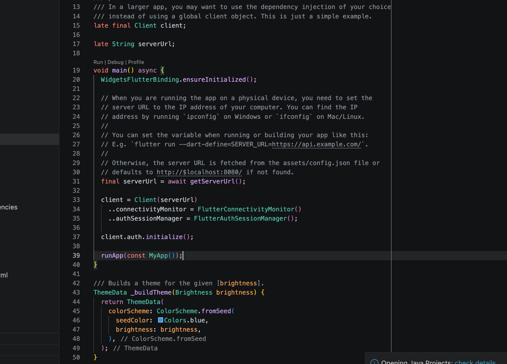

You can point `serverUrl` at any address — as long as that's where your backend is actually hosted. By default it falls back to `http://localhost:8080` (or whatever port your local server ends up running on), because right now your backend is running on your own machine. Once you deploy your backend somewhere else, you'll update this URL to point to that host instead.

---

## Step 5: The server entry point — `server.dart`

`server.dart`, inside your server project, is the entry point to your backend code. Serverpod sets up a few things here out of the box:

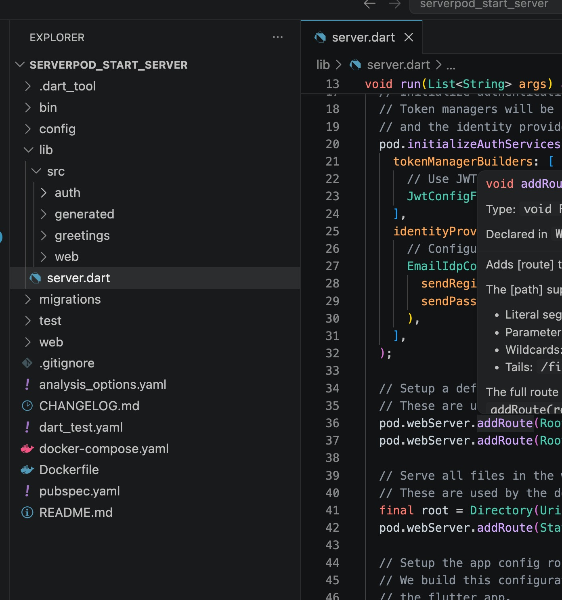

Don't worry about all of it right away — some of what you'll see are default routes you can use if you're building raw REST APIs directly with Serverpod. We'll come back to this in more detail later.

---

## Step 6: Start the database and run the server

Back in your terminal, inside the `_server` folder, start the Docker containers:

```bash
docker compose up -d
```

Make sure Docker Desktop is still open when you run this.

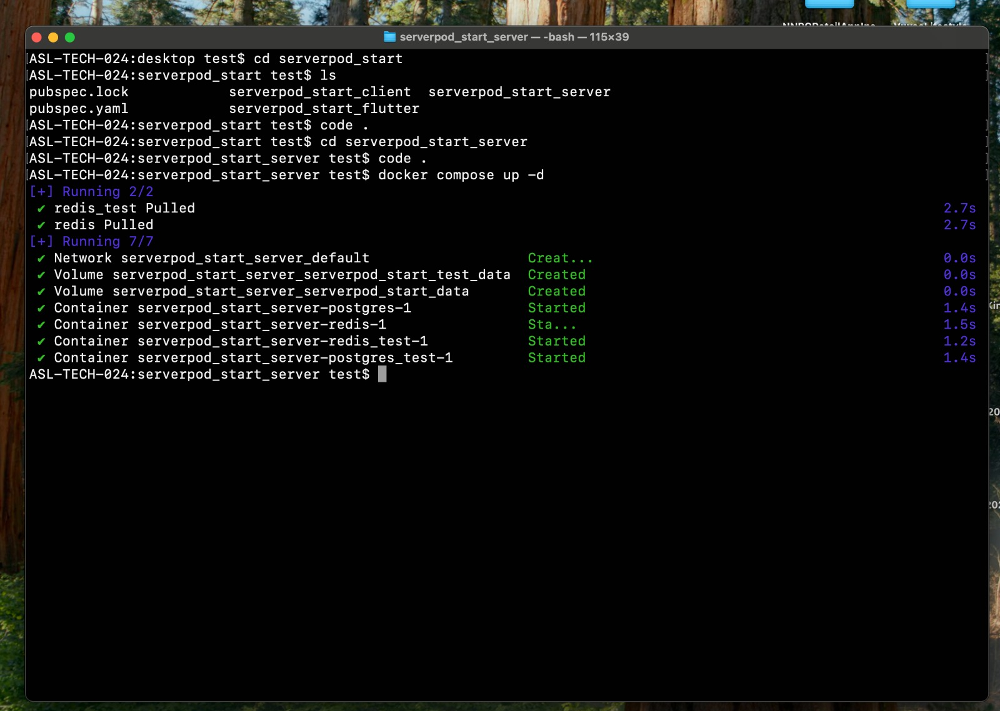

Next, apply your database migrations and start the server:

```bash
dart bin/main.dart --apply-migrations
```

Applying migrations is important — in most cases you'll want to run with this flag. There are situations where you might skip it, but as a beginner, it's safest to always include it.

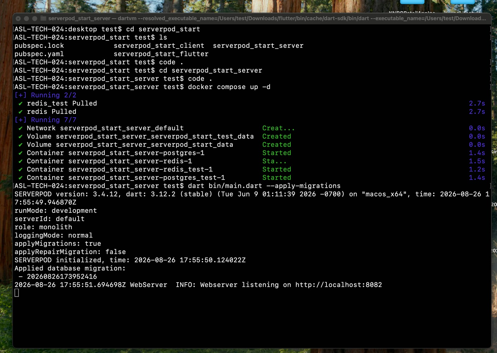

Once it's running, you'll see a line like:

```
WebServer INFO: Webserver listening on http://localhost:8082
```

Your backend is now live locally.

> **Tip:** It's worth working with two editor windows open — one for the whole project, and a second one scoped just to the `_server` folder. It makes it easier to keep backend work separate from the Flutter app.

---

## Step 7: Run the Flutter app

In a separate terminal (or your second editor window), navigate to your Flutter folder and run the app:

```bash
cd your_project_name_flutter
flutter run -d chrome
```

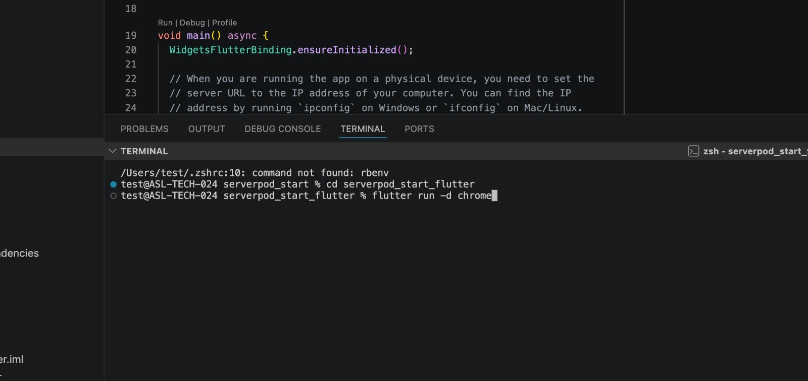

Once it launches, you should see the default Serverpod example app in your browser — a text field where you can type your name and get a response back from the server:

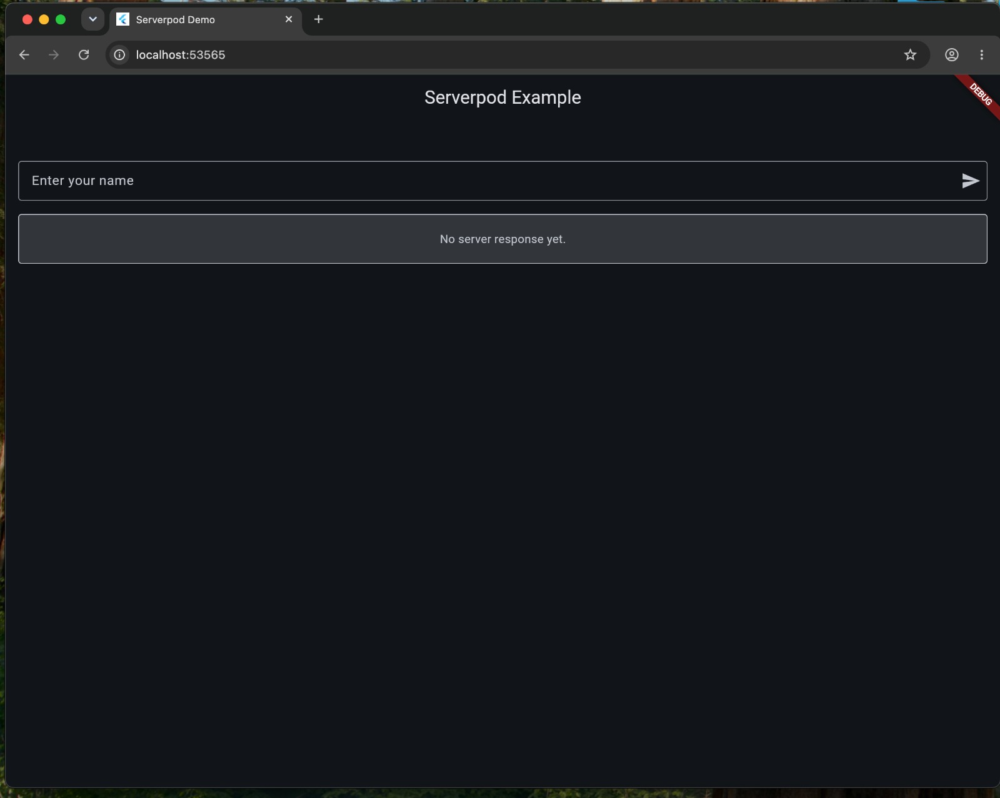

Type your name in and submit — you should see a greeting like "Hello, \[your name]" come back, confirming your Flutter app is successfully talking to your backend.

---

## Step 8: Creating your first endpoint

Now for the fun part — building your own API. In Serverpod, every endpoint is a class that extends `Endpoint`. Each **method** you add to that class becomes callable from your Flutter app, similar to a URL path in a REST API (e.g. `todo/addTodo`).

You can organize endpoints however makes sense for your app — for example, a `TodoEndpoint` for to-do related actions, a `UserEndpoint` for user-related actions, and so on.

Here's a bare `TodoEndpoint`, created at `lib/src/todo/todo_endpoint.dart`:

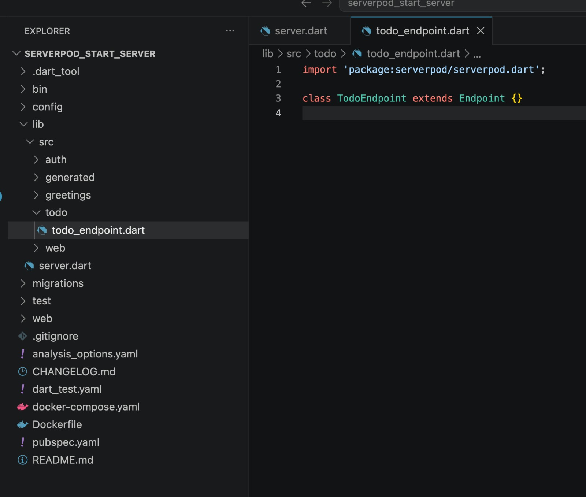

```dart
import 'package:serverpod/serverpod.dart';

class TodoEndpoint extends Endpoint {}
```

From here, you'd add methods inside this class — each one becomes a callable API method once you run `serverpod generate` to regenerate the type-safe client code.

---

## Step 9: Add your endpoint functions

Every function you write inside a Serverpod endpoint **must** return a `Future` (or a `Stream`). This is because calls from the Flutter app to your server go over the network, and Serverpod needs an async type to handle that.

For a simple todo list, add a `List<String>` to hold your todos in memory, then write three functions: one to add a todo, one to remove a todo, and one to fetch all the todos.

```dart
import 'package:serverpod/serverpod.dart';

class TodoEndpoint extends Endpoint {
  List<String> todos = [];

  Future<String> addTodo(Session session, String todo) async {
    todos.add(todo);

    return todo;
  }

  Future<String> removeTodo(Session session, int todoIndex) async {
    String aboutToDeleteTodo = todos[todoIndex];

    todos.removeAt(todoIndex);

    return aboutToDeleteTodo;
  }

  Future<List<String>> fetchTodos(Session session) async {
    return todos;
  }
}
```

A couple of things worth noticing:
- Every method's **first parameter** is a `Session session` — Serverpod passes this in automatically, and you use it to access things like the database, passwords, and the current request's context.
- `addTodo` and `removeTodo` return the todo they just added or removed. That's a small touch that makes it easy for the Flutter app to show a confirmation message without doing a second round trip.
- Storing `todos` as an in-memory list works for learning the basics, but it resets every time you restart the server. Once you get to models and the database, you'll persist this properly.

---

## Step 10: Generate the endpoint code

Serverpod needs to generate the matching client-side code before your Flutter app can call these new methods. From your server folder, run:

```bash
cd your_project_name_server
serverpod generate
```

This regenerates the bindings in `generated/protocol.dart` on the server, and — more importantly for us — regenerates the type-safe client in the `_client` package. That's what lets you write `client.todo.addTodo(...)` from Flutter and get full autocomplete and type checking.

> Re-run `serverpod generate` any time you add, remove, or change the signature of an endpoint method.

---

## Step 11: Build the todo list screen

In your Flutter project, create a new folder called `screens` (if you don't already have one) inside `lib/`, and add a file called `todo_list_screen.dart`. This will be a `StatefulWidget` that fetches, adds, and removes todos, and renders them in a `ListView`.

```dart
import 'package:flutter/material.dart';
import '../main.dart';

class TodoListScreen extends StatefulWidget {
  const TodoListScreen({super.key});

  @override
  State<TodoListScreen> createState() => _TodoListScreenState();
}

class _TodoListScreenState extends State<TodoListScreen> {
  final TextEditingController _todoController = TextEditingController();

  List<String> _todos = [];

  bool _isLoading = false;
  bool _isFetchingTodos = true;

  @override
  void initState() {
    super.initState();
    _fetchTodos();
  }

  @override
  void dispose() {
    _todoController.dispose();
    super.dispose();
  }

  Future<void> _fetchTodos() async {
    setState(() => _isFetchingTodos = true);

    try {
      final todos = await client.todo.fetchTodos();

      if (!mounted) return;

      setState(() {
        _todos = todos;
      });
    } catch (e) {
      if (mounted) {
        _showMessage('Failed to fetch todos: $e');
      }
    } finally {
      if (mounted) {
        setState(() => _isFetchingTodos = false);
      }
    }
  }

  Future<void> _addTodo() async {
    final todo = _todoController.text.trim();

    if (todo.isEmpty) return;

    setState(() => _isLoading = true);

    try {
      final addedTodo = await client.todo.addTodo(todo);

      if (!mounted) return;

      setState(() {
        _todos.add(addedTodo);
        _todoController.clear();
      });
    } catch (e) {
      _showMessage('Failed to add todo: $e');
    } finally {
      if (mounted) {
        setState(() => _isLoading = false);
      }
    }
  }

  Future<void> _removeTodo(int index) async {
    setState(() => _isLoading = true);

    try {
      final removedTodo = await client.todo.removeTodo(index);

      if (!mounted) return;

      setState(() {
        _todos.removeAt(index);
      });

      _showMessage('$removedTodo removed');
    } catch (e) {
      _showMessage('Failed to remove todo: $e');
    } finally {
      if (mounted) {
        setState(() => _isLoading = false);
      }
    }
  }

  void _showMessage(String message) {
    ScaffoldMessenger.of(context).showSnackBar(
      SnackBar(content: Text(message)),
    );
  }

  @override
  Widget build(BuildContext context) {
    return Scaffold(
      appBar: AppBar(
        title: const Text('My Todos'),
        centerTitle: true,
        actions: [
          IconButton(
            onPressed: _isFetchingTodos ? null : _fetchTodos,
            icon: const Icon(Icons.refresh),
          ),
        ],
      ),
      body: Column(
        children: [
          Padding(
            padding: const EdgeInsets.all(16),
            child: Row(
              children: [
                Expanded(
                  child: TextField(
                    controller: _todoController,
                    textInputAction: TextInputAction.done,
                    onSubmitted: (_) => _isLoading ? null : _addTodo(),
                    decoration: InputDecoration(
                      hintText: 'What do you need to do?',
                      border: OutlineInputBorder(
                        borderRadius: BorderRadius.circular(12),
                      ),
                    ),
                  ),
                ),
                const SizedBox(width: 8),
                FilledButton(
                  onPressed: _isLoading ? null : _addTodo,
                  child: const Text('Add'),
                ),
              ],
            ),
          ),

          if (_isLoading || _isFetchingTodos) const LinearProgressIndicator(),

          Expanded(
            child: _isFetchingTodos
                ? const Center(
                    child: CircularProgressIndicator(),
                  )
                : _todos.isEmpty
                ? const Center(
                    child: Text(
                      'No todos yet.\nAdd your first todo above!',
                      textAlign: TextAlign.center,
                    ),
                  )
                : RefreshIndicator(
                    onRefresh: _fetchTodos,
                    child: ListView.separated(
                      padding: const EdgeInsets.symmetric(horizontal: 16),
                      itemCount: _todos.length,
                      separatorBuilder: (_, __) => const SizedBox(height: 8),
                      itemBuilder: (context, index) {
                        return Card(
                          child: ListTile(
                            leading: CircleAvatar(
                              child: Text('${index + 1}'),
                            ),
                            title: Text(_todos[index]),
                            trailing: IconButton(
                              onPressed: _isLoading
                                  ? null
                                  : () => _removeTodo(index),
                              icon: const Icon(Icons.delete_outline),
                            ),
                          ),
                        );
                      },
                    ),
                  ),
          ),
        ],
      ),
    );
  }
}
```

A few things worth calling out for beginners reading this:

- `_isLoading` and `_isFetchingTodos` are two separate flags — one covers the initial load, the other covers add/remove actions — so the UI can show the right loading state (a full-screen spinner on first load, a slim progress bar on subsequent actions) instead of one blocking the other.
- `import '../main.dart';` is what gives this file access to the global `client` object you saw back in Step 4.

---

## Step 12: Show the new screen

Open `main.dart` in your Flutter project and swap out the default demo body for your new `TodoListScreen`. Import it at the top of the file:

```dart
import 'screens/todo_list_screen.dart';
```

Then, in your `MyApp` widget (or wherever your `Scaffold`/`home` is defined), replace the body with:

```dart
home: const TodoListScreen(),
```

The exact line will depend on how your `main.dart` is structured, but the idea is the same: wherever the app currently builds the default "Enter your name" demo widget, point it at `TodoListScreen()` instead.

---

## Step 13: Reload and try it out

With the server still running from Step 6, hot reload (or fully restart) your Flutter app:

```bash
flutter run -d chrome
```

You should now see your todo list screen instead of the demo screen. Try it out:

- Type something into the text field and tap **Add** — it should show up in the list.
- Tap the trash icon on a todo — it should disappear and a snackbar should confirm it was removed.
- Tap the refresh icon in the app bar — it re-fetches the list from the server.

You're now adding, deleting, and fetching todos through a real Serverpod endpoint. 🎉

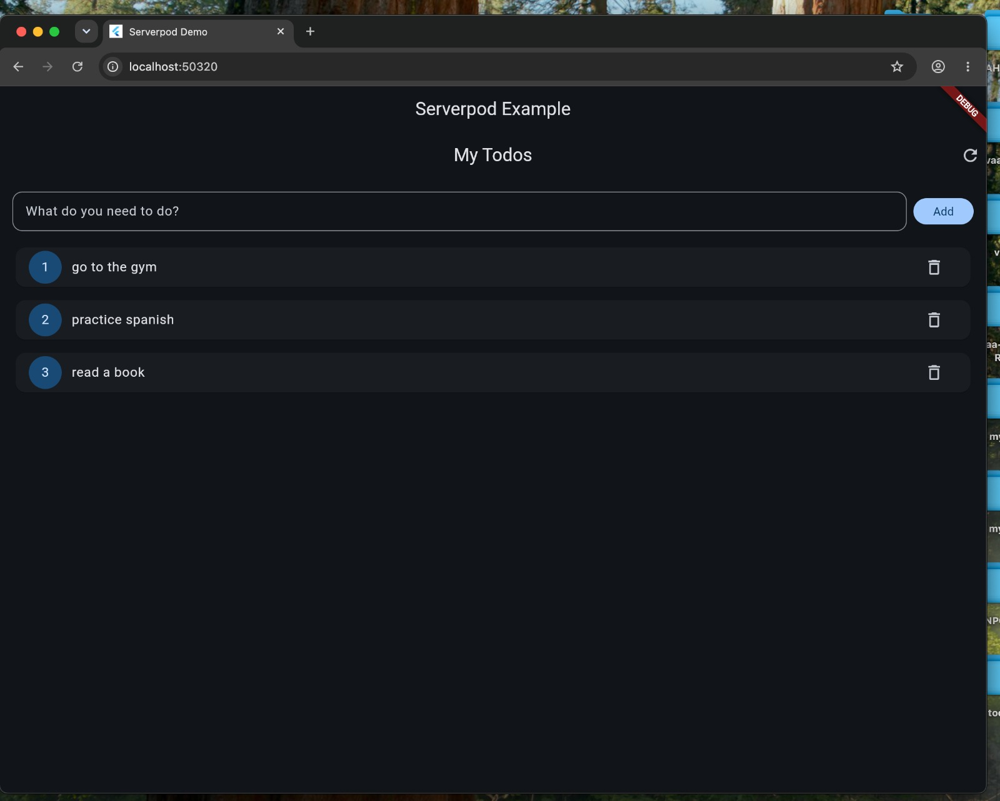

> **Remember:** because `todos` lives in memory on the server, restarting the server (`dart bin/main.dart --apply-migrations`) will clear the list. That's expected for now — we'll fix it by persisting todos to the database in Part 3.
